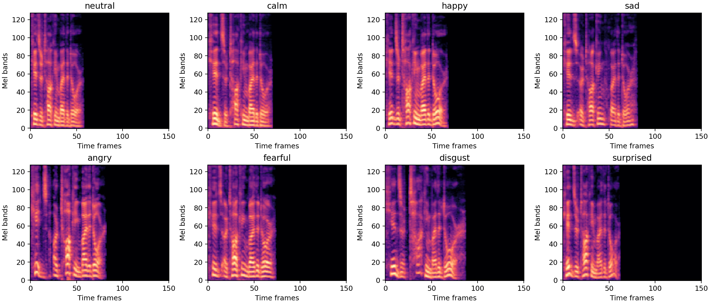
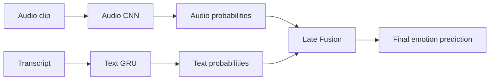
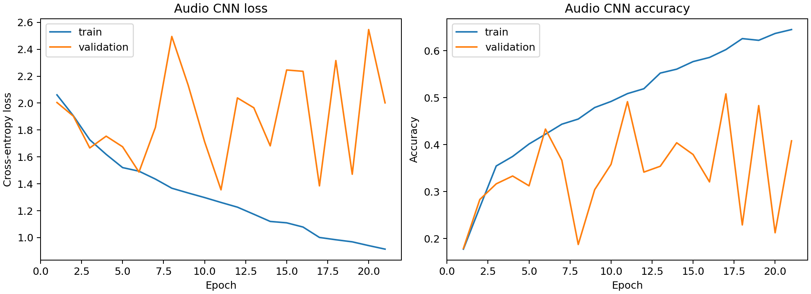
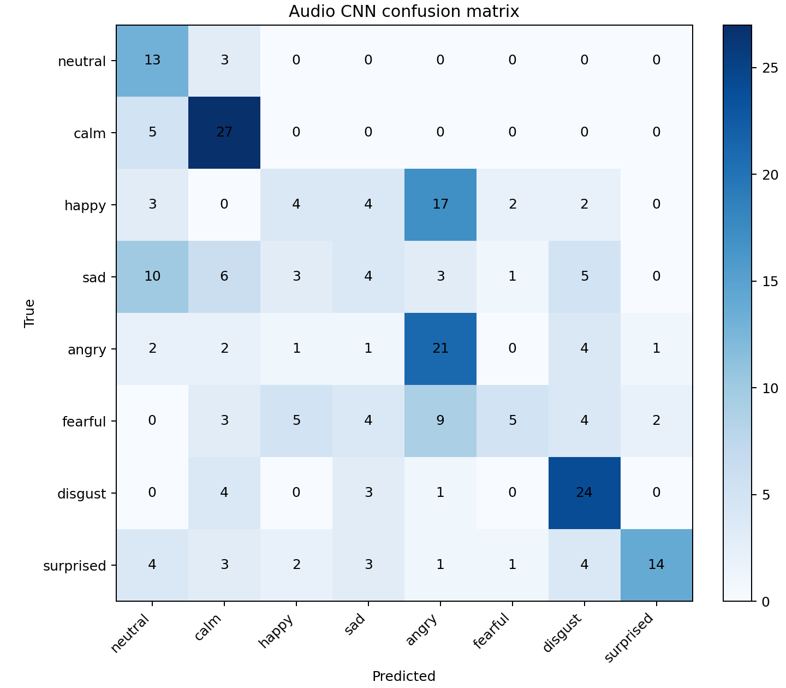
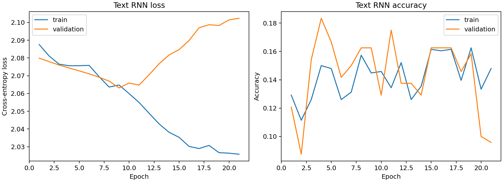
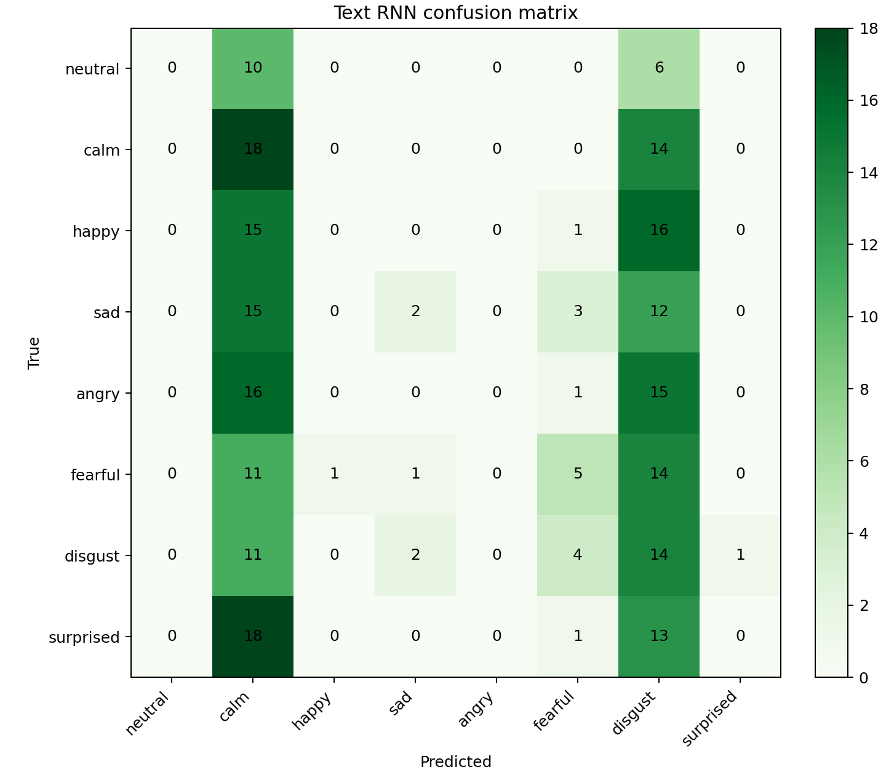
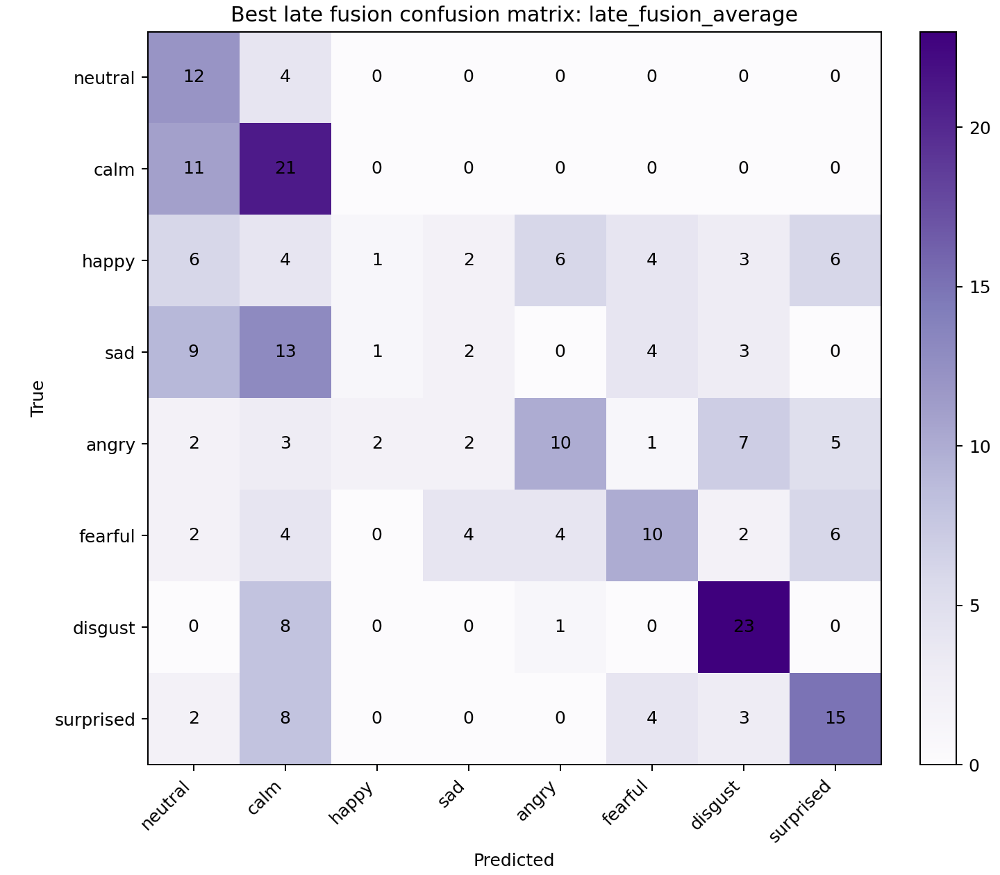

# Multimodal Emotion Recognition on RAVDESS

## 1. Objective

The goal of this project is to classify human emotion from speech using two modalities:

1. **Audio**: raw `.wav` files are converted into Mel-spectrograms and classified using a CNN.
2. **Text**: speech is transcribed using Whisper, converted into token sequences, and classified using a GRU-based RNN.

The final system compares unimodal models against a late-fusion multimodal model.

## 2. Dataset

This project uses the RAVDESS Emotional Speech Audio dataset. It contains 1,440 speech clips from 24 actors.

The target emotions are:

| Code | Emotion |
|---|---|
| 01 | neutral |
| 02 | calm |
| 03 | happy |
| 04 | sad |
| 05 | angry |
| 06 | fearful |
| 07 | disgust |
| 08 | surprised |

The label is encoded in the filename. For example:

```text
03-01-06-01-02-01-12.wav
      ^^ emotion code = 06 = fearful
```

### Dataset Challenges

RAVDESS is useful for a controlled baseline, but it has important limitations:

- It is small for deep learning: only 1,440 clips.
- The `neutral` class has 96 samples, while every other class has 192 samples.
- Actors differ in voice, pitch, speaking style, and emotional expression.
- The text content is controlled and repetitive: the clips mostly contain only two sentences.
- Text transcripts therefore contain weak semantic emotion information.

Because of this, the project uses an **actor-based split** instead of a random clip split. This is harder but more honest, because the test set contains speakers not seen during training.

Final split:

| Split | Samples |
|---|---:|
| Train | 960 |
| Validation | 240 |
| Test | 240 |

## 3. Audio Pipeline

### Audio Preprocessing

Each audio clip was processed as follows:

1. Load audio with `librosa`.
2. Resample to 22,050 Hz.
3. Convert to mono.
4. Trim silence.
5. Normalize loudness.
6. Pad or crop to 3.5 seconds.
7. Convert to a Mel-spectrogram.
8. Convert power values to decibels.
9. Standardize using the training-set mean and standard deviation.

The final CNN input shape is:

```text
(1440, 128, 151, 1)
```

This means:

| Dimension | Meaning |
|---|---|
| 1440 | number of audio clips |
| 128 | Mel frequency bands |
| 151 | time frames |
| 1 | grayscale image channel |

Example Mel-spectrograms:



### Audio CNN Architecture


The CNN learns local time-frequency patterns. For emotion recognition, these patterns may correspond to pitch changes, intensity, pauses, speaking rate, and spectral energy.

## 4. Text Pipeline

### Transcript Generation

Whisper `tiny.en` was used to generate transcripts. FFmpeg was not available, so the script loaded `.wav` files with `librosa` and passed the audio arrays directly into Whisper.

Transcript summary:

| Item | Value |
|---|---:|
| Total transcripts | 1,440 |
| Unique normalized transcripts | 98 |
| Exact match to expected sentence | 89.17% |

Most common transcripts:

| Transcript | Count |
|---|---:|
| kids are talking by the door | 650 |
| dogs are sitting by the door | 634 |

This confirms that the text modality is weak for emotion classification in this dataset, because the spoken words are mostly the same across emotions.

### Text Preprocessing

Each transcript was:

1. Lowercased.
2. Cleaned by removing punctuation.
3. Split into word tokens.
4. Converted into token IDs using a vocabulary built from the training set.
5. Padded or cropped to length 10.

Final text input shape:

```text
(1440, 10)
```

Vocabulary size:

```text
84
```

### Text RNN Architecture


A GRU was chosen because the text sequences are short. A bidirectional GRU can read the sentence from both directions, although in this dataset the sentence content itself is not very emotional.

## 5. Multimodal Fusion

Late fusion was used. The audio and text models were trained separately, then their softmax probability outputs were combined.

Tested strategies:

1. Average probabilities.
2. Weighted average: 70% audio, 30% text.
3. Weighted average: 85% audio, 15% text.
4. Maximum confidence rule.



Late fusion was chosen because the text model is much weaker than the audio model. This makes it safer to combine final probabilities rather than forcing early feature fusion.

## 6. Results

### Main Comparison

| Model | Accuracy (%) | Macro F1 (%) |
|---|---:|---:|
| audio_cnn | 38.33 | 34.24 |
| text_rnn | 16.25 | 9.67 |
| late_fusion_average | 39.17 | 35.30 |

### Late Fusion Comparison

| Fusion Strategy | Accuracy (%) | Macro F1 (%) |
|---|---:|---:|
| Average | 39.17 | 35.30 |
| 70% audio + 30% text | 38.75 | 34.55 |
| 85% audio + 15% text | 38.33 | 34.24 |
| Max confidence | 38.33 | 34.24 |

### Training Curves and Confusion Matrices

Audio CNN training curves:



Audio CNN confusion matrix:



Text RNN training curves:



Text RNN confusion matrix:



Best late-fusion confusion matrix:



## 7. Analysis

The audio model performed much better than the text model. This is expected because emotion in RAVDESS is primarily expressed through acoustic features such as tone, pitch, rhythm, and intensity.

The text model performed poorly because the transcript content is almost always one of two fixed sentences. This means the text does not describe the emotion. For example, a happy clip and a sad clip may both say:

```text
Kids are talking by the door.
```

Therefore, a text model has little meaningful information to separate emotions. Any signal it learns probably comes from Whisper transcription errors caused by emotional delivery, not from the words themselves.

Late fusion slightly improved performance over the audio-only model. The improvement was small because the text model was weak. This shows an important multimodal learning lesson: adding another modality helps only when that modality contains useful complementary information.

## 8. Conclusion

The best-performing model was late fusion with average probabilities:

```text
Accuracy: 39.17%
Macro F1: 35.30%
```

The project demonstrates a complete multimodal emotion-recognition pipeline:

- audio preprocessing with Mel-spectrograms
- CNN-based audio classification
- Whisper transcript generation
- tokenization and GRU-based text classification
- late-fusion multimodal evaluation
- accuracy, F1-score, confusion matrix, and training-curve analysis

The main conclusion is that audio is the dominant modality for this dataset. Text transcripts are useful for demonstrating a multimodal pipeline, but they are not very informative for emotion recognition on RAVDESS because the spoken content is controlled and repetitive.

## 9. Possible Improvements

Future work could improve performance by:

- using data augmentation such as pitch shifting, time stretching, and noise injection
- trying stronger CNN architectures or transfer learning from audio models
- using MFCCs or additional prosodic features alongside Mel-spectrograms
- tuning hyperparameters more carefully
- using early fusion with bottleneck features
- using a dataset where text content varies naturally with emotion
- training with cross-validation across actors for more stable estimates

## 10. Reproducibility

Important scripts:

| Purpose | Script |
|---|---|
| Create dataset index | `src/data/create_index.py` |
| Build audio features | `src/features/build_audio_features.py` |
| Generate transcripts | `src/features/generate_transcripts.py` |
| Build text features | `src/features/build_text_features.py` |
| Train Audio CNN | `src/training/train_audio_cnn.py` |
| Train Text RNN | `src/training/train_text_rnn.py` |
| Run late fusion | `src/fusion/late_fusion.py` |
| Build result table | `src/evaluation/build_results_table.py` |

Environment:

```text
Python 3.12
PyTorch 2.11.0+cu128
GPU: NVIDIA GeForce RTX 4050 Laptop GPU
```

## 11. Bonus Challenge Results

Two bonus experiments were added after the original baseline.

### Data Augmentation

The audio training set was augmented with background noise. Validation and test clips were left clean, so the evaluation remained realistic. Pitch-shift augmentation is implemented as an optional flag in `src/features/build_augmented_audio_features.py`, but the completed experiment used noise augmentation because it was faster and sufficient for a clear improvement.

Noise augmentation improved the audio model substantially:

| Model | Accuracy (%) | Macro F1 (%) |
|---|---:|---:|
| Original Audio CNN | 38.33 | 34.24 |
| Audio CNN + noise augmentation | 46.67 | 43.10 |

This suggests that the original CNN was overfitting to the small training set. Adding noisy variants made the model more robust.

### Transformer Upgrade

A DistilBERT text branch was trained using the Whisper transcripts. It achieved:

| Model | Accuracy (%) | Macro F1 (%) |
|---|---:|---:|
| Text GRU | 16.25 | 9.67 |
| DistilBERT text branch | 17.50 | 8.01 |

DistilBERT did not significantly improve the text branch because the transcript content is still mostly limited to two repeated sentences. This reinforces the conclusion that the text modality is weak for RAVDESS.

### Best Bonus Fusion

The best bonus result came from averaging the probability outputs of the noise-augmented audio CNN and DistilBERT:

| Bonus Model | Accuracy (%) | Macro F1 (%) |
|---|---:|---:|
| Augmented audio + DistilBERT average fusion | 47.92 | 44.38 |

This is the best result in the project. The improvement mostly comes from audio augmentation, not from text semantics.
